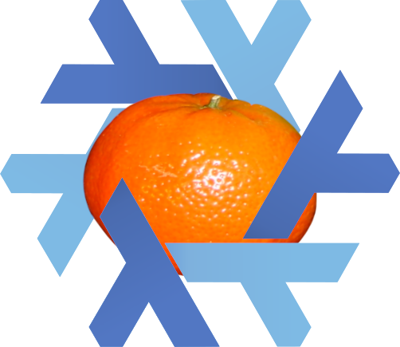

# TangeriNixOS

[NixOS](https://nixos.org/) tailored for pentesting.

Think [Kali](https://www.kali.org/) / [Parrot](https://parrotlinux.org/), but being a customisation of [NixOS](https://nixos.org/) instead of being based on Debian.


## How to use

It is meant to be installed and run from a [NixOS](https://nixos.org/) host, using a [qemu](https://www.qemu.org/) virtual machine.

```
# Pull the configuration
git clone git@github.com:Pamplemousse/tangerinixos.git
# Build and run the VM
nix-shell -p nixos-generators --run "nixos-generate -f vm -c ./tangerinixos.nix --run"
```

### Tips

  * Shared folder: Host's `/run/user/$(id -u)/nix-vm.<ID>` is mounted as `/tmp/xchg` in VM;
  * SSH traffic is forwarded from host: `ssh rpaulson@127.0.0.1 -p 8022` to connect to the VM.

## Limitations

  * **VM configuration**:
    Is defined by the `nixos-generate -f vm` command given above, with no control over the image parameters, or the starting script.
    It would be great to be able define alternative networking options (interfacing, mapping of ports between host and guest, etc.).
  * **Customizability**:
    It requires manual editing of files after the `clone`. It would be nice to offer higher level options.
  * **Lack of packages**:
    [Are We Hackers Yet?](https://jjjollyjim.github.io/arewehackersyet/index.html) keeps track of the effort of bringing Kali packages into [`Nixpkgs`](https://github.com/NixOS/Nixpkgs).
    Not all are yet available, but it's getting there!
    Be part of the effort by contributing to [NixOS for Pentesting Overview](https://github.com/NixOS/nixpkgs/issues/81418).
  * **Too many packages (for maintenance)**:
    Not all the packages from Kali available in [`Nixpkgs`](https://github.com/NixOS/Nixpkgs) evaluates properly...
    Increasing the number of packages for `tangerinixos` implies increasing the risk of evaluation (hence building) failures.


## Credits

  * The [logo](./tangerinixos.png) uses:
    - A picture shared by Doudoulolita, CC BY-SA 3.0 <https://creativecommons.org/licenses/by-sa/3.0>, via Wikimedia Commons;
    - Artwork from the NixOS organisation, CC BY 4.0, <https://creativecommons.org/licenses/by/4.0/>.
